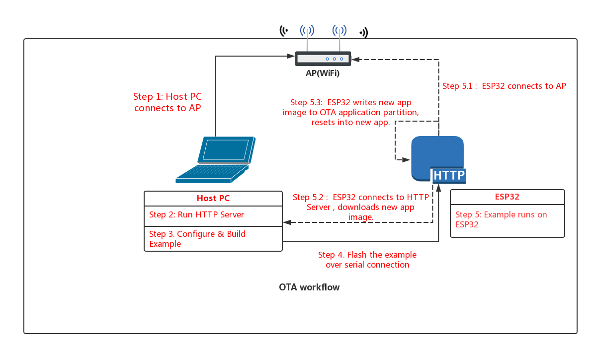

# 简化的 OTA Demo

本示例用于演示对固件空中升级的流程。

本示例是一个简化版的演示程序，对于实际的产品，你应当使用安全协议，例如 HTTPs。

---

# 目标

运行在 ESP32 上面的应用程序可以通过下载一个新的镜像文件并将其存储到 flash 上面来进行更新。

在这个例子中，ESP32 在 flash 上面有三个镜像：工厂、OTA_0、OTA_1，它们每个镜像都是一个子包含的分区。OTA 镜像分区的数量由分区表布局决定。

使用命令 `make flash` 通过串口烧写本示例可以实现更新工厂应用程序镜像的目的。在第一次启动时，bootloader 会加载工厂 app 镜像，然后执行 OTA 更新。更新时会从 http 服务器下载新的镜像，并将它保存到 OTA_0 分区。此时，示例代码会更新 ota_data 分区，表示有新的应用程序分区，然后复位。复位后，bootloader 会读取 ota_data，并判断出有新的 OTA 镜像，然后运行它。


# 工作流程

框图 OTA_workflow.png 描述了真个工作流程：



## Step 1: 连接到 AP

将你的 PC 连接到你将会在 ESP32 上面使用的同一个 AP。


## Step 2: 运行 HTTP 服务器

Python 有一个内置的 HTTP 服务器，我们这里可以直接使用它。

我们将会使用示例 `get-started/hello_world` 作为需要更新的固件。

打开一个终端，输入如下的命令来编译示例并启动服务器：

```
cd $IDF_PATH/examples/get-started/hello_world
make
cd build
python -m SimpleHTTPServer 8070
```

服务器运行后，构建目录的内容可以通过网址 http://localhost:8070/ 浏览到。

NB: 在某些系统中，命令可能是 `python2 -m SimpleHTTPServer`。

NB: 你可能已经注意到，用于更新的 "hello world" 没有任何特殊之处，这是因为由 esp-idf 编译的任何 .bin 应用程序都可以作为 OTA 的应用程序。唯一的区别是它是会被写到工厂分区还是 OTA 分区。

如果你的防火墙阻止了对端口 8070 的访问，请在本示例运行期间打开它。
If you have any firewall software running that will block incoming access to port 8070, configure it to allow access while running the example.

## Step 3: 编译 OTA 示例

回到 OTA 示例目录，输入命令 `make menuconfig` 对 OTA 示例进行配置。在子菜单 "Example Configuration" 下面，详细填写如下信息：

* WiFi SSID & Password
* "HTTP Server" 的 IP 地址，即你的 PC 的 IP 地址
* HTTP 端口号

保存你的改动，然后输入 `make` 命令来编译该示例。

## Step 4: 烧写 OTA 示例

在烧写时，需要先用目标 `erase_flash` 来擦除整个 flash（这会删除之前在 ota_data 分区留下的所有数据），然后通过串口烧写工厂进行：

```
make erase_flash flash
```

`make erase_flash flash` 表示 "擦除所有的东西，然后开始烧写"。`make flash` 只会擦除需要重写的那部分 flash。

## Step 5: 运行 OTA 示例

示例程序启动后，它会打印 "ota: Starting OTA example..."，然后：

1. 使用所配置的 SSID 和密码连接 AP。
2. 连接到 HTTP 服务器并下载新的镜像。
3. 将镜像写到 flash 中，并进行配置，让板子下次从这个镜像启动。
4. Reboot

# 疑难杂症

* 检查你的 PC 是否能 ping 通 ESP32 的 IP，检查配置菜单中 IP、AP 以及其它配置是否正确。
* 检查是否有防火墙阻止访问你的 PC。
* 通过浏览网址 http://127.0.0.1/ 检查是否可以看到配置文件（默认是 hello-world.bin）
* 如果你还有其它 PC 或手机，可以试试能否看到该文件。

## 错误 "ota_begin error err=0x104"

如果你看到这个错误，请检查你的分区表，查看所配置的 flash 大小是否足够。默认的 "two OTA slots" 分区表仅能在 4MB 的 flash 上工作。如果你的 flash 小于 4 MB，则需要创建一个自定义的分区表 CSV（查看 components/partition_table）并在配置菜单中对其进行配置。

如果改变了分区表的布局，则在这两个步骤之间通常还需要运行 "make erase_flash"。

## 产品的实现


如果想在产品中使用这个示例，需要考虑：

* 使用加密通信协议，例如 HTTPS。
* 初始超时或者烧写过程中的 WiFi 断开的情形
